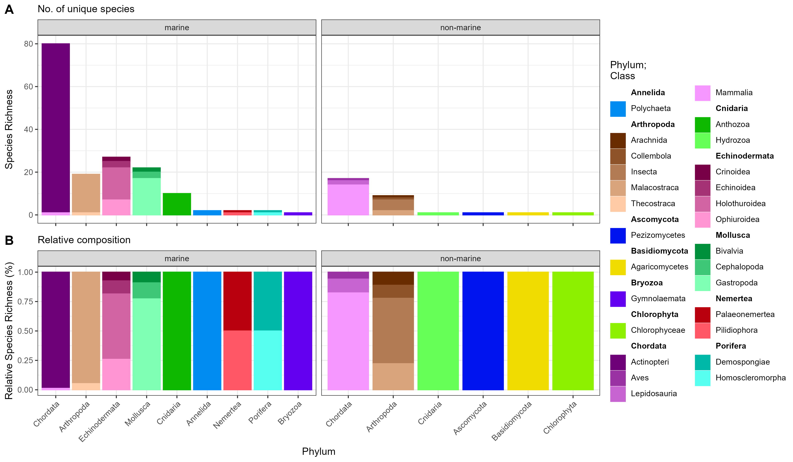
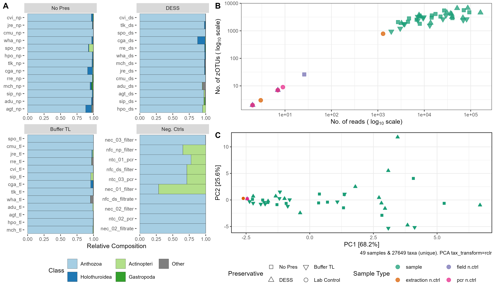
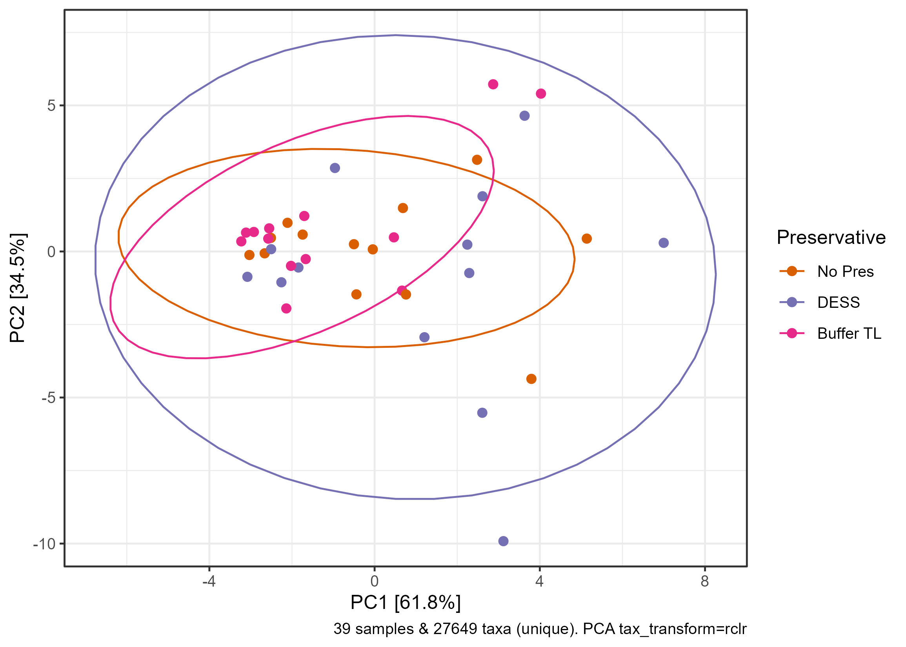

# Analytical Pipeline
---

This directory contains all the scripts that were used to process the quant data from the **Rota Marine eDNA** project (project code: `rme`).

The DNA concentrations (*ng/ul* for accuclear quant kit; *pg/ul* for accublue-nextgen quant kit) were calculated using the [DNA Quantification Toolkit](https://github.com/tamucc-gcl/gcl_bioinformatic_tools/blob/main/labTools/DNA_Quant/README.md) by Selwyn and Bird (2025).

---

## [`01_wrangle_quant-results.R`](./01_wrangle_quant-results.R)
This script compiles and standardizes DNA quantification data generated by the [DNA Quantification Toolkit](https://github.com/tamucc-gcl/gcl_bioinformatic_tools/blob/main/labTools/DNA_Quant/README.md). It merges all quantification results into a single, clean dataset ready for downstream statistical analysis and visualization.

 Click for script details 

### Input
- [`rme_dna_2024-02-06_sample-concentration.csv`](../data/rme_dna_2024-02-06_sample-concentration.csv)
- [`rme_preservative_dna_2024-11-06_sample-concentration.csv`](../data/rme_preservative_dna_2024-11-06_sample-concentration.csv)

### Output
- [`quant_report_compiled.csv`](../data/quant_report_compiled.csv)

### Pipeline
- reads in CSV files from all quantification modules, converts units (from picograms to nanograms where applicable), and ensures consistent column naming conventions
- merges datasets, extracts metadata (e.g., site codes, preservative codes), and adds derived variables (e.g., extraction_round, treatment, extraction_strategy)
- quality control: harmonizing treatment labels, recoding labels, and computing log-transformed DNA concentrations (log10_dna_concentration) to support normalization and statistical modeling

### Notes

- Calculation of the DNA concentrations were done using [DNA Quantification Tools](https://github.com/tamucc-gcl/gcl_bioinformatic_tools/blob/main/labTools/DNA_Quant/README.md). 
 
- There were two quant kits used for the assay. The first was [AccuClear Ultra High Sensitivity dsDNA Quantitation Solution](https://biotium.com/product/accuclear-ultra-high-sensitivity-dsdna-quantitation-solution) (sensitivity range: 0.03 - 250 ng). However, we found out that the concentration of the eDNA was quite low, and we needed a more sensitive assay. We switched to [AccuBlue NextGen dsDNA Quantitation Kit](https://biotium.com/product/accublue-nextgen-dsdna-quantitation-kit/) (sensitivity range: 1 - 3000 pg = 0.001 - 3.0 ng). 

- Deviations of our analysis from the product manual are as follows:
	- We used all the raw RFU of the standards for fitting the regression model instead of just using their mean. This was done to preserve the variation of standard RFUs in model fitting.
	- The regression model was fitted using log10-transformed variables (y = DNA_per_well; x = RFU).  
		- Since variables that are less than or equal to zero cannot be log10-transformed, we did not calculate for the zeroed RFU (i.e., measured RFU - mean RFU of zero standard). 
		- The zero standard was also removed in fitting the regression model
	- The best model for the dataset is chosen by comparing several metrics (RSE, AIC, BIC), as well as weighing the models based on complexity (power > linear > polynomial)
			
- There are two sources of eDNA for each sample: (1) filters and (2) preservatives/filtrate. 
	- We initially used AccuClear for eDNA extracted from filters. We found out that some samples were way below the detection limit of AccuClear, so we switched to AccuBlue-NextGen. 
	- Quant measurements from filters used both AccuClear and AccuBlue-NextGen. However, more samples had RFU measurements that were within the standards used for the former than the latter, thus we used the former for calculating DNA concentration.
 	- Quant measurements from the preservatives used AccuBlue-NextGen. All samples had RFUs that were within the standards used.
	- DNA from filters were quantified with AccuClear using 5 ul input volume, so no replication was done to conserve samples. Thus, SD cannot be calculated for these samples.
	
- eDNA from preservative were quant-ed using AccuBlue-NextGen, thus the unit of measurement is **pg/ul**. This script converts the units from **pg/ul** to **ng/ul** before merging the datasheets across all quant results. 

---
## [`02_wrangle_data-frame-for-statistical-tests.R`](02_wrangle_data-frame-for-statistical-tests.R) 

This script prepares and consolidates all data required for downstream analyses. It integrates datasets from multiple sources into a unified, analysis-ready data frame. All major wrangling steps were done on this script. The output is a tidy dataset (CSV and RDS formats) containing quantification metrics alongside metadata relevant for statistical modeling. 

 Click for script details 

### Input
- [`quant_report_compiled.csv`](../data/quant_report_compiled.csv) (Output from Step 1)
- [`rme_plate_normalization_for_pcr.xlsx`](../data/rme_plate_normalization_for_pcr.xlsx)
- [`rme_site-info.xlsx`](../data/rme_site-info.xlsx)
- [`rme_pcr-score.xlsx`](../data/rme_pcr-score.xlsx)
- [`rme_pcr-16_sample_concentrations.csv`](../data/rme_pcr-16_sample_concentrations.csv)
- [`rme_sample-info.xlsx`](../data/rme_sample-info.xlsx)
- [`rme_timeline.xlsx`](../data/rme_timeline.xlsx)

### Output
- [`df_for_stats.csv`](../data/df_for_stats.csv)
- [`df_for_stats.rds`](../data/df_for_stats.rds)

### Pipeline
- Compiles the following datasets:
	- eDNA Quant results (output from Step 01)
	- normalized DNA concentrations
	- PCR amplification scores
	- PCR quant restuls
	- site metadata
	- sample information
	- field timelines 
- standardizes sample identifiers and variable names across datasets
- reclassifies treatment levels and sample sources for consistency
- assigns field control timestamps and calculating the duration of samples kept on ice

---

## [`03_plot_timeline.R`](./03_plot_timeline.R)

This script visualizes the sample preservation timeline for eDNA field collections and and the subsequent coldchain events. It produces a time-based graphic summarizing the chronological sequence and duration of different storage conditions used during the sample handling process.

 Click for script details 

### Input
- [`rme_timeline.xlsx`](../data/rme_timeline.xlsx)

### Output
- [`plot_timeline.png`](../results/plot_timeline.png)

### Pipeline
- use `viztime` package to prepare data frame for plotting

---
## [`04_plot_collection-sites.R`](./04_plot_collection-sites.R)

This script generates a map showing sampling locations in Rota Island, Commonwealth of the Northern Mariana Islands (CNMI). It integrates spatial data from shapefiles and site metadata from an Excel file to visualize sampling sites with labeled points and an inset map for geographic context.

 Click for script details 

### Input
- [`rota_shapefile`](../data/rota_shapefile/)
- [`CNMI_shape_files`](../data/cnmi_map/)
- [`rme_site-info.xlsx`](../data/rme_site-info.xlsx)

### Output
- [`plot_sampling_site.png`](../results/plot_sampling_site.png)

- [`rme_site-info.csv`]("../results/rme_site-info.csv")

### Pipeline
- reads and transforms shapefiles to WGS84 coordinates
- cleans and indexes the site information
- and uses `sf` and `ggplot2` for visualization

---

## [`05_model_quant-results.R`](./05_model_quant-results.R) 

This script performs a statistical analysis of DNA quantification data, including model fitting, diagnostics, and visualization of DNA concentrations across treatments and sources. The workflow evaluates experimental controls and compare treatment effects using Generalized Linear Mixed-Model (GLMM).

 Click for script details 

### Input
- [`df_for_stats.rds`](../data/df_for_stats.rds) (Output from Step 02)

### Output
- [`plot_compare_control.png`](../results/plot_compare_control.png)

- [`plot_model_coef.png`](../results/plot_model_coef.png)

- [`plot_contrasts`](../results/plot_model-contrasts.png)

- [`model_emmeans.csv`](../results/model_emmeans.csv)

### Pipeline
- assesses the distribution of DNA concentration values using Cullen and Frey plots and fits multiple parametric distributions
- test differences in DNA concentration between controls using ANOVA
	- controls were merged since they are not different from each other
- test effects of source x treatment on eDNA concentration using GLMM
	- random effects: 
		- site 
		- filters nested within sites
- model comparison
- model diagnositcs by analyzing residuals
- calculate estimated marginal means (EMM) using `emmeans`
- calculate %DNA recovery
- visualize model EMM, model coefficients, and %DNA Recovery

### Notes 
* The DNA concentrations were compared between field and extraction controls. Since there was no significant difference, both controls were collapsed into a single factor and was used as the reference baseline for the model. 
* There were no significant differences among slopes based on `emtrends`.
* The model shows the following significant effects relative to the baseline (Filter x Neg Ctrl)
	* Filter x No Pres
	* Filter x DESS
	* Preservative x Buffer TL 
	

---

## [`06_model_amplification-yield.R`](./06_model_amplification-yield.R) 

This script performs a statistical analysis of PCR amplification yield, including model fitting, diagnostics, and visualization. Generalized Linear Mixed Model (GLMM) is used for model-fitting.

A limit of detection (LoD), defined as the lowest concentration of the standard that was accurately detected by the AccuClear Assay, was used to determine whether amplification is successful ([PCR] yield ≥ LoD) or not ([PCR] < LoD).

 Click for script details 

### Input
- [`df_for_stats.rds`](../data/df_for_stats.rds) (Output from Step 02)
- [`rme_pcr-16_accuclear_models_2025-07-02.rds`](./data/rme_pcr-16_accuclear_models_2025-07-02.rds)

### Output
- [`plot_pcr-quant-model.png`](../results/plot_pcr-quant-model.png)

- [`plot_logistic-regression_pcr-amplification_buffer-tl-only.png`](../results/plot_logistic-regression_pcr-amplification_buffer-tl-only.png)

- [`model_coef_amplicon-concentration.csv`](../results/model_coef_amplicon-concentration.csv)

### Pipeline
- follows the same general pipeline as modeling DNA concentration (Step 05). This includes calculating EMMs, model diagnostics, and visualization
- classifies samples based on amplification success ([PCR] yield ≥ LoD)
- calculates %samples amplified based on amplification successful

## [`07_wrangle_sequence-data.R`](./07_wrangle_sequence-data.R) 

This script generates a phyloseq object using the `rainbow-bridge` outfiles and external metadata in preparation for downstream analyses.

 Click for script details 

### Input
- [`rme_sample-info.xlsx`](../data/rme_sample-info.xlsx) 
- [`rme_water-params.xlsx`](.../data/rme_water-params.xlsx)
- [`rme_site-info.xlsx`](../data/rme_site-info.xlsx)
- [`rme_maynard-metadata.xlsx`](../data/rme_maynard-metadata.xlsx)
- [`seq_sample_info.csv`](../data/seq_sample_info.csv)
- [`zotu_table.csv`](../data/rainbow-bridge/zotu_table.csv) (Output from `rainbow_bridge`)
- [`lowest_taxonomy_table.csv`](../data/rainbow-bridge/lowest_taxonomy_table.csv) (Output from `rainbow_bridge`)
- [`zotu_sequences.fasta`](../data/rainbow-bridge/zotu_sequences.fasta) (Output from `rainbow_bridge`)

### Output
- [`rme_phyloseq.rds`](../data/rme_phyloseq.rds)
- [`plot_16su-empricial.png`](../results/plot_16su-empricial.png)

### Pipeline
- Reads in `rainbow_bridge` outfiles along with relevant sequence metadata
- Decodes sequence IDs 
- Classifies zOTU habitats (marine vs non-marine) based on their taxonomic assignments
- Generate a phyloseq file with all the metadata

### Notes
* Site was relabeld from Okgok (OKG) to Talakhaya (TLK)

## [`08_decontaminate_zotus.R`](./08_decontaminate_zotus.R) 

Identify and remove contaminant zOTUs. Perform PCA ordination at various stages of decontamination. 

Decontamination was done using the decontam package [(Davis et al., 2018)](https://link.springer.com/article/10.1186/s40168-018-0605-2).

 Click for script details 

### Input
- [`rme_phyloseq.rds`](../data/rme_phyloseq.rds) (Output from Step 07) 

### Output
- [`rme_phyloseq_decontaminated.rds`](../data/rme_phyloseq_decontaminated.rds)
- [`PERMANOVA and PERMDISP results`](../results/permanova_sample_ctrl.txt)
- [`plot_ordination_post-decon-no-marine.png`](../results/plot_ordination_post-decon-no-marine.png)

- [`plot_neg_ctrl_ordination_post-decon-no-marine_samples-only.png`](../results/plot_neg_ctrl_ordination_post-decon-no-marine_samples-only.png)

### Pipeline
- Decontaminate dataset
- Visualize species composition and PCA ordination of the dataset at various stages of decontamination
- Perform PERMANOVA and PERMDISP to test differences in community composition (1) between samples and controls, and (2) among preservation treatments within sample 

